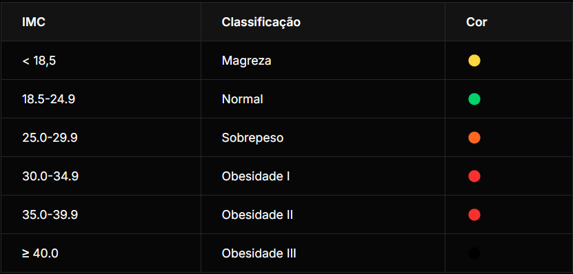

# Calculadora de IMC

  

**Calculadora de IMC completa com classificação.** Os usuários inserem **peso (kg)** e **altura (m)** nos campos designados, o sistema calcula automaticamente o **IMC**, exibe o **resultado numérico** e sua **classificação por faixa** (magreza, normal, sobrepeso, obesidade). Inclui **botão de reset** e **alertas visuais** sobre as condições de saúde.

## ✨ **Demo**

[🔗 Calcule seu IMC agora](https://seu-imc-calculator.netlify.app) *(substitua pelo link do seu deploy)*

## 📊 **Classificação IMC (Adultos)**
<br><br>

<br><br>

## 📱 Funcionalidades
- ✅ **Cálculo automático IMC** = peso / (altura²)
- ✅ **Classificação visual** por cores e ícones
- ✅ **Validação de entrada** (números válidos)
- ✅ **Reset completo** da aplicação
- ✅ **Alertas de saúde** personalizados
- ✅ **Responsivo** mobile-first
- ✅ **Acessibilidade** WCAG 2.1
- ✅ **Animações suaves** CSS

## 🧮 Fórmula do IMC
```
IMC = peso(kg) / altura(m)²
Exemplo: 70kg / (1.75m)² = 22.86 (Normal)
```

## 🛠️ Tecnologias
```
- Vanilla JavaScript (ES6+)
- HTML5 Semantic
- CSS3 Flexbox/Grid
- LocalStorage (opcional)
- Design System
```

## 🚀 Instalação & Uso

```
# 1. Baixe ou clone
git clone https://github.com/seuusuario/imc-calculator.git

# 2. Abra index.html no navegador
# OU simplesmente abra o arquivo HTML
```

### Funciona 100% offline! 🌐

## 🎮 Como usar
1. **Digite** seu **peso** em kg
2. **Digite** sua **altura** em metros (ex: 1,75)
3. **Clique** "Calcular IMC" ou Enter
4. **Veja** resultado + classificação
5. **Reset** para novo cálculo

## 🎨 Capturas de tela
| Tela Principal | Resultado Normal | Obesidade|
| ------------- | ------ | ---------- |
|  |  |  |

## 💻 Código Principal
```
const calcularIMC = (peso, altura) => {
  const imc = peso / (altura * altura);
  return {
    valor: parseFloat(imc.toFixed(2)),
    classificacao: getClassificacao(imc)
  };
};

const getClassificacao = (imc) => {
  if (imc < 18.5) return "Magreza";
  if (imc < 25) return "Normal";
  // ... mais condições
};
```

## 🔔 Alertas de Saúde

 - **Magreza**: "Consulte um nutricionista"
 - **Normal**: "Peso saudável! 🎉"
 - **Sobrepeso**: "Atenção ao peso"
 - **Obesidade**: "Procure ajuda médica"

## ♿ Acessibilidade
- ✅ **ARIA labels** completos
- **✅ Teclado Foco visível**
- **✅ Contraste WCAG AA**
- **✅ Compatível com leitor de tela**
- **✅ Navegação por teclado**

## 🔧 Customizações
1. **Faixas etárias**: Adicione crianças/idosos
2. **Histórico**: Salve cálculos no localStorage
3. **Gráficos**: Chart.js para evolução
4. **Idioma**: Português/Inglês
5. **Tema**: Modo Escuro/Claro

## 🤝 Contribuindo
```
1. Fork o projeto
2. Crie issue com sugestão
3. Branch `feat/sua-ideia`
4. Pull Request ✨
```

## 📄 Licença

**MIT** - Livre para uso!

## 🙋 ♂️ Autor
**`Desenvolvedor Web`**
[ParreirasJuniorWeb](https://github.com/ParreirasJuniorWeb)
📧 [joaoparreiras2020@gmail.com](mailto:joaoparreiras2020@gmail.com)
💼 [jvparreiras](https://linkedin.com/in/jvparreiras)

<div align="center"> 
  <br><br>
  Cuide da sua saúde! Calculadora de IMC precisa e confiável 🩺
</div> 
